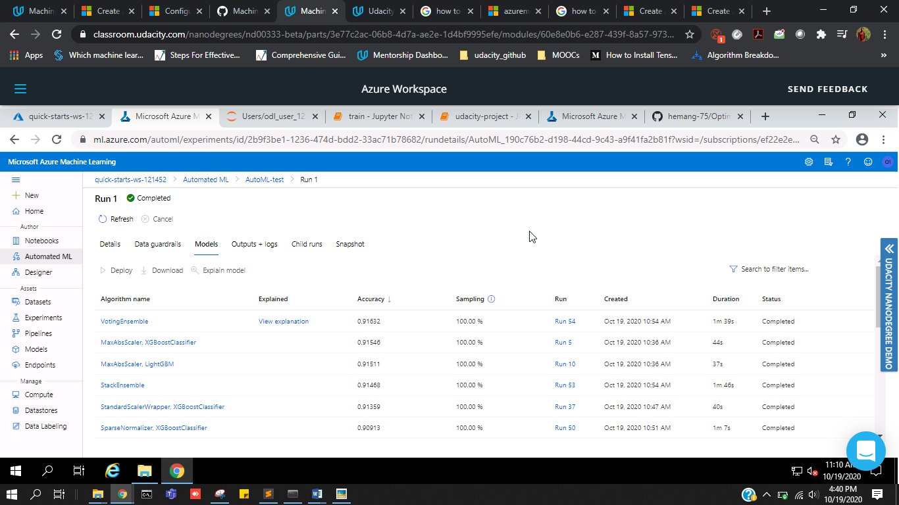

# Optimizing an ML Pipeline in Azure

## Overview
This project is part of the Udacity Azure ML Nanodegree.
In this project, we build and optimize an Azure ML pipeline using the Python SDK and a provided Scikit-learn model.
This model is then compared to an Azure AutoML run.

## Summary

In this problem the dataset contains data about the financial and personal details of the customers of a Portugese bank. We seek to predict if the customer will subscribe to bank term deposit or not.

Out of all the models , the best performing model was a Soft Voting Ensemble found using AutoML. It uses XGBoost Classifier with a standard scaler wrapper.

## Scikit-learn Pipeline

### Pipeline Architecture
- In the Pipeline, first the dataset is retrieved from the given url using AzureDataFactory class. <br>
- Then the data is cleaned using clean_data method in which some preprocessing steps were performed like converting categorical variable to binary encoding, one hot encoding,etc and then the dataset is split in ratio of 70:30 (train/test) for training and testing and sklearn's LogisticRegression Class is used to define Logistic Regression model. <br>
- Then the model is trained using the hyperparameters which can be passed as argument to the train.py script. The hyperparameters that can be tuned are C and max_iter. C is the inverse regularization parameter and max_iter is the maximum number of iterations. <br>
- Then accuracy was calculated on the test set which is also the defining metric. <br>

### Benefits of parameter sampler
- The parameter sampler is used to provide different choices of hyperparameters to choose from and try during hyperparameter tuning using hyperdrive. <br>
- In the parameter sampler, the different choices for the values of C and max_iter are provided so that the hyperdrive can try all the combinations of choices to do the hyperparameter tuning in order to get the best model with the maximum accuracy.

### Benefits of Early Stopping policy
- One can define an Early Stopping policy in HyperDriveConfig and it is useful in stopping the HyperDrive run if the accuracy of the model is not improving from the best accuracy by a certain defined amount after every given number of iterations <br>
- In this model,we have defined a Bandit Policy for early stopping with the parameters slack_factor and evaluation_interval which are defined as :
  - slack_factor :  The amount of slack allowed with respect to the best performing training run. This factor specifies the slack as a ratio. <br>
  - evaluation_interval : The frequency for applying the policy. Each time the training script logs the primary metric counts as one interval.<br>
- The main benefit of using early stopping is it saves a lot of computational resources

## AutoML
- AutoML did a great task and i was surprised to see that AutoML tried so many different models in such a short time some of which i couldn't even think of trying or implementing. The models tried by AutoML were RandomForests,BoostedTrees,XGBoost,LightGBM,SGDClassifier,VotingEnsemble, etc. AutoML used many different input preprocessing normalization like Standard Scaling, Min Max Scaling, Sparse Normalizer, MaxAbsScaler, etc. It has also handled class imbalance very well by itself. <br>
- Here is the list of all the models tested during AutoML run :



## Pipeline comparison

- Overall,the difference in accuracy between the AutoML model and the Hyperdrive tuned custom model is not too much. AutoML accuracy was 0.9177 while the Hyperdrive accuracy was 0.9100

- With Respect to architecture AutoML was better than hyperdrive because it tried a lot of different models, which was quite impossible to do with Hyperdrive because for that we have to create pipeline for every model.

- There was not much difference in accuracy maybe because of the data set but AutoML really tried and computed some very complex models to get the best result and model out of the given dataset.

## Future work

- One thing which i would want in future as further improvement will be to able to give different custom cross validation strategy to the AutoML model. 


## Proof of cluster clean up

- Here is the snapshot of deleting the compute cluster i took when the cluster was getting deleted


```python

```
